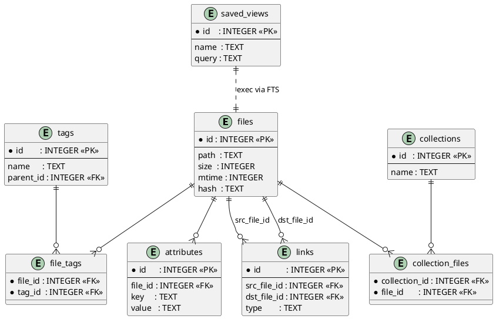

# DP-001: Schema v1.1 – Core Metadata Domains

**Status**: Proposed  
**Authors**: @carol  
**Date**: 2025-05-17

## 1. Context

We’ve landed a basic SQLite-backed `files` table and a contentless FTS5 index. Before we build out higher-level features, we need to lock down our **v1.1** metadata schema for:

- **Hierarchical tags** (`tags` + `file_tags`)
- **Custom attributes** (`attributes`)
- **File-to-file relationships** (`links`)
- **Named collections** (`collections` + `collection_files`)
- **Saved views** (`saved_views`)

Locking this schema now lets downstream CLI & GUI work against a stable model and ensures our migrations stay easy to reason about.  
*Note: Tag aliases and their `canonical_id` support are deferred to DP-006 (v1.5).*

## 2. Decision

Each migration will begin by enabling foreign-key enforcement and WAL journaling:

```sql
PRAGMA foreign_keys = ON;
PRAGMA journal_mode = WAL;
````

All foreign keys use `ON DELETE CASCADE` so deleting a file, tag, etc. automatically cleans up dependents.

1. **Bump to schema version 1.1** in our `schema_version` table.
2. Provide four migration scripts, applied in order:

   1. **0001\_initial\_schema.sql** – create core tables (`files`, `tags`, `file_tags`, `attributes`), a contentless FTS5 table (`files_fts`), core FTS triggers, and performance-critical indexes.
   2. **0002\_update\_fts\_and\_triggers.sql** – replace old tag/attr FTS triggers with `INSERT OR REPLACE` semantics for full-row refresh.
   3. **0003\_create\_links\_collections\_saved\_views.sql** – introduce `links`, `collections`, `collection_files`, and `saved_views` tables.
   4. **0004\_fix\_hierarchical\_tags\_fts.sql** – refine FTS triggers to index full hierarchical tag-paths via a recursive CTE.
3. Expose this schema through our library (`libmarlin::db::open`) so any client sees a v1.1 store.

## 3. ER Diagram

Below is the updated entity-relationship diagram (PlantUML):



Or in plain-ASCII:

```ascii
┌────────┐        ┌────────────┐        ┌───────┐
│ files  │1────*──│ file_tags  │*────1─│ tags  │
└────────┘        └────────────┘        └───────┘
     │                                    
     │1                                   
     *                                    
┌────────────┐                           
│ attributes │                           
└────────────┘                           

┌────────┐       ┌────────┐       ┌────────┐
│ files  │1──*──│ links  │*───1──│ files  │
└────────┘       └────────┘       └────────┘

┌─────────────┐     ┌──────────────────┐     ┌────────┐
│ collections │1──*─│ collection_files │*──1─│ files  │
└─────────────┘     └──────────────────┘     └────────┘

┌─────────────┐
│ saved_views │
│ (exec FTS)  │
└─────────────┘
```

## 4. Migration Summary

| File                                                   | Purpose                                                       |
| ------------------------------------------------------ | ------------------------------------------------------------- |
| **0001\_initial\_schema.sql**                          | Core tables + contentless FTS + core triggers + indexes       |
| **0002\_update\_fts\_and\_triggers.sql**               | Full-row FTS refresh on tag/attr changes                      |
| **0003\_create\_links\_collections\_saved\_views.sql** | Add `links`, `collections`, `collection_files`, `saved_views` |
| **0004\_fix\_hierarchical\_tags\_fts.sql**             | Recursive CTE for full tag-path indexing in FTS triggers      |

### Performance-Critical Indexes

* `idx_files_path`       on `files(path)`
* `idx_files_hash`       on `files(hash)`
* `idx_tags_name_parent` on `tags(name, parent_id)`
* `idx_file_tags_tag_id` on `file_tags(tag_id)`
* `idx_attr_file_key`    on `attributes(file_id, key)`

## 5. Example CLI Session

```bash
$ marlin init
Database initialised at ~/.local/share/marlin/index_*.db
Initial scan complete – indexed/updated 42 files

$ marlin link add ./todo.md ./projects/plan.md
Linked './todo.md' → './projects/plan.md'

$ marlin coll create "MyDocs"
Created collection 'MyDocs'

$ marlin view save tasks "tag:project AND TODO"
Saved view 'tasks' = tag:project AND TODO

$ marlin view list
tasks: tag:project AND TODO

$ marlin view exec tasks
~/Projects/Alpha/draft1.md
~/Projects/Beta/final.md
```

## 6. Consequences

* **Backward compatibility**: older v1.0 stores will be migrated on first open.
* **Stability**: downstream features (TUI, VS Code, web UI) can depend on a stable v1.1 schema.
* **Simplicity**: by consolidating metadata domains now, future migrations remain small and focused.
* **Performance**: v1.1 schema meets our cold-start P95 ≤ 3 s on a 100 k-file corpus (with CI-enforced benchmarks and the indexes above).

---

*End of DP-001*