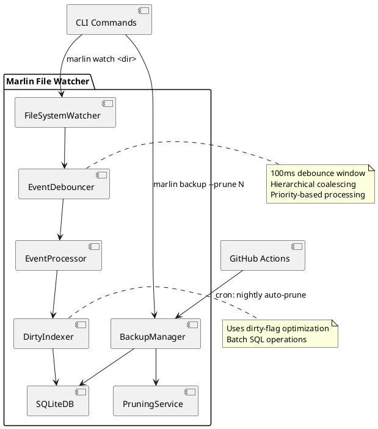

# DP-003: File-Watcher Lifecycle & Debouncing

**Status**: Proposed  
**Authors**: @cline  
**Date**: 2025-05-19

## 1. Context

As part of Epic 2 (Live Mode & Self-Pruning Backups), we need to implement a file system watcher that automatically updates the Marlin index when files are created, modified, or deleted. This introduces challenges around managing event floods, debouncing, and lifecycle management to ensure stable and efficient operation without overwhelming the SQLite database or CPU.

Our goals are:
- Implement the `marlin watch <dir>` command
- Handle file system events efficiently with proper debouncing
- Ensure stable operation during high file activity
- Integrate with our existing SQLite-based indexing system
- Support backup pruning (`backup --prune N`) and auto-prune functionality

## 2. Decision

We'll implement a file-watcher system using the `notify` crate (which uses inotify on Linux and FSEvents on macOS) with the following architecture:

1. **Event Batching & Debouncing**:
   - Use a 100ms debounce window to collect and coalesce events
   - Implement a hierarchical debouncing strategy where directory modifications implicitly debounce contained files
   - Use a priority queue where file creation/deletion events have precedence over modification events

2. **Watcher Lifecycle**:
   - Implement a proper state machine with states: Initializing, Watching, Paused, Shutdown
   - Add graceful shutdown with a configurable drain period to process remaining events
   - Include pause/resume capabilities for high-activity scenarios or during backup operations

3. **Database Integration**:
   - Batch database operations to minimize write transactions
   - Use the `--dirty` flag internally to optimize updates for changed files only
   - Implement a "catchup scan" on startup to handle changes that occurred while not watching

4. **Backup & Pruning**:
   - Add `backup --prune N` to maintain only the N most recent backups
   - Implement a GitHub Action for nightly auto-prune operations
   - Include backup verification to ensure integrity

## 3. Architecture Diagram



## 4. Implementation Details

### 4.1 File Watcher Interface

```rust
pub struct FileWatcher {
    state: WatcherState,
    debouncer: EventDebouncer,
    processor: EventProcessor,
    config: WatcherConfig,
}

pub enum WatcherState {
    Initializing,
    Watching,
    Paused,
    ShuttingDown,
    Stopped,
}

pub struct WatcherConfig {
    debounce_ms: u64,           // Default: 100ms
    batch_size: usize,          // Default: 1000 events
    max_queue_size: usize,      // Default: 100,000 events
    drain_timeout_ms: u64,      // Default: 5000ms
}

impl FileWatcher {
    pub fn new(paths: Vec<PathBuf>, config: WatcherConfig) -> Result<Self>;
    pub fn start(&mut self) -> Result<()>;
    pub fn pause(&mut self) -> Result<()>;
    pub fn resume(&mut self) -> Result<()>;
    pub fn stop(&mut self) -> Result<()>;
    pub fn status(&self) -> WatcherStatus;
}
```

### 4.2 Event Debouncer

```rust
pub struct EventDebouncer {
    queue: PriorityQueue<FsEvent>,
    debounce_window_ms: u64,
    last_flush: Instant,
}

impl EventDebouncer {
    pub fn new(debounce_window_ms: u64) -> Self;
    pub fn add_event(&mut self, event: FsEvent);
    pub fn flush(&mut self) -> Vec<FsEvent>;
    pub fn is_ready_to_flush(&self) -> bool;
}

#[derive(PartialEq, Eq, PartialOrd, Ord)]
pub enum EventPriority {
    Create,
    Delete,
    Modify,
    Access,
}

pub struct FsEvent {
    path: PathBuf,
    kind: EventKind,
    priority: EventPriority,
    timestamp: Instant,
}
```

### 4.3 Backup and Pruning

```rust
pub struct BackupManager {
    db_path: PathBuf,
    backup_dir: PathBuf,
}

impl BackupManager {
    pub fn new(db_path: PathBuf, backup_dir: PathBuf) -> Self;
    pub fn create_backup(&self) -> Result<BackupInfo>;
    pub fn prune(&self, keep_count: usize) -> Result<PruneResult>;
    pub fn list_backups(&self) -> Result<Vec<BackupInfo>>;
    pub fn restore_backup(&self, backup_id: String) -> Result<()>;
    pub fn verify_backup(&self, backup_id: String) -> Result<bool>;
}

pub struct BackupInfo {
    id: String,
    timestamp: DateTime<Utc>,
    size_bytes: u64,
    hash: String,
}

pub struct PruneResult {
    kept: Vec<BackupInfo>,
    removed: Vec<BackupInfo>,
}
```

## 5. Example CLI Session

```bash
# Start watching a directory
$ marlin watch ~/Documents/Projects
Watching ~/Documents/Projects (and 24 subdirectories)
Press Ctrl+C to stop watching

# In another terminal, create/modify files
$ touch ~/Documents/Projects/newfile.txt
$ echo "update" > ~/Documents/Projects/existing.md

# Back in the watch terminal, we see:
[2025-05-19 11:42:15] CREATE ~/Documents/Projects/newfile.txt
[2025-05-19 11:42:23] MODIFY ~/Documents/Projects/existing.md
Index updated: 2 files processed (1 new, 1 modified, 0 deleted)

# Create a backup and prune old ones
$ marlin backup --prune 5
Created backup bak_20250519_114502
Pruned 2 old backups, kept 5 most recent
Backups retained:
- bak_20250519_114502 (12 MB)
- bak_20250518_230015 (12 MB)
- bak_20250517_230012 (11 MB)
- bak_20250516_230013 (11 MB)
- bak_20250515_230014 (10 MB)

# Check watcher status
$ marlin watch --status
Active watcher: PID 12345
Watching: ~/Documents/Projects
Running since: 2025-05-19 11:41:02 (uptime: 00:01:45)
Events processed: 42 (5 creates, 35 modifies, 2 deletes)
Queue status: 0 pending events
```

## 6. Integration Tests

We'll implement comprehensive integration tests using `inotify-sim` or similar tools:

1. **Event Flood Test**: Generate 10,000 rapid file events and verify correct handling
2. **Debounce Test**: Verify that multiple events on the same file within the window are coalesced
3. **Hierarchical Debounce Test**: Verify that directory modifications correctly debounce contained files
4. **Shutdown Test**: Verify graceful shutdown with event draining
5. **Stress Test**: Run an 8-hour continuous test with periodic high-activity bursts

## 7. Backup Pruning Tests

1. **Retention Test**: Verify that exactly N backups are kept when pruning
2. **Selection Test**: Verify that the oldest backups are pruned first
3. **Integrity Test**: Verify that pruning doesn't affect remaining backup integrity
4. **Auto-Prune Test**: Simulate the GitHub Action and verify correct operation

## 8. Consequences

* **Stability**: The system will gracefully handle high-activity periods without overwhelming the database
* **Performance**: Efficient debouncing and batching will minimize CPU and I/O load
* **Reliability**: Better lifecycle management ensures consistent behavior across platforms
* **Storage Management**: Backup pruning prevents unchecked growth of backup storage

## 9. Success Metrics

Per the roadmap, the success criteria for Epic 2 will be:
* 8-hour stress-watch altering 10k files with < 1% misses
* Backup directory size limited to N as specified

---

*End of DP-003*
